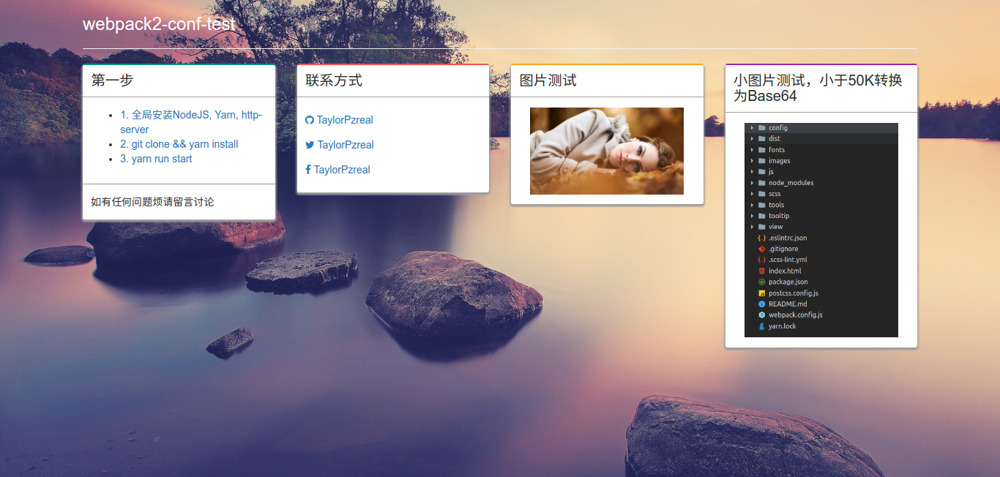

# webpack2-conf-test
Webpack2在项目中的配置实践 :clap::clap::clap::100:
***

1. [cross-env](https://www.npmjs.com/package/cross-env) 很好用的定义全局变量的工具。
2. [http-server](https://www.npmjs.com/package/http-server) 很好用的0配置的启动一个Http服务

***
#### 测试截图

##### 讨论
如有任何不妥当不正确之处烦请各位指正，一起学习，一起进步。:stuck_out_tongue_winking_eye:
