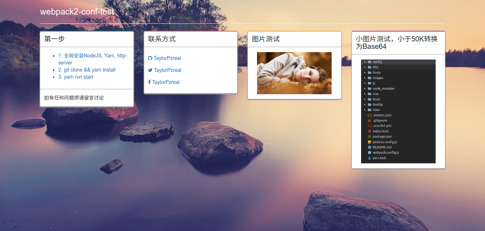

# webpack2-conf-test:100:
Webpack2在项目中的配置实践 :clap::clap::clap:
***
### 一、使用指南
- 首先安装nodejs环境，并且安装Yarn
- git clone git@github.com:TaylorPzreal/webpack2-conf-test.git && yarn install
- yarn run start

### 二、比较实用的工具
1. [cross-env](https://www.npmjs.com/package/cross-env) 很好用的定义全局变量的工具。
2. [http-server](https://www.npmjs.com/package/http-server) 很好用的0配置的启动一个Http服务

***
### 三、测试截图

### 四、讨论

目前只配置成这样，还需继续学习，继续修改。
如有任何不妥当不正确之处烦请各位同学指正，一起学习，一起进步。:stuck_out_tongue_winking_eye:
